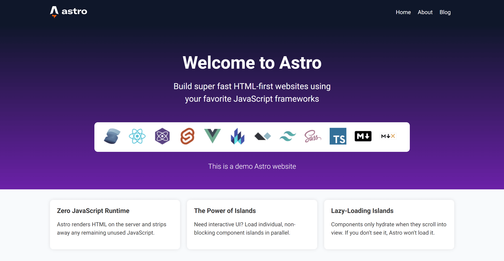

# Astro Demo

[View Live Site](https://benz-astro.netlify.app/)

An astro-clone landing page built with Astro.

## Features

- Ultra fast loading because Astro ships zero Javascript by default. Bundle size are smaller too.
- This is a simple website contains only Astro Components so no islands architecture implemented.
- Impressive Performance Scores on PageSpeed Insights.

## Preview

## Tech stack

- [Astro](https://astro.build/)
- [Typescript Interfaces](https://www.typescriptlang.org/docs/handbook/2/everyday-types.html#interfaces)
- HTML
- CSS

## Show your support

Give a ⭐️ if you like this project!

## License

[MIT](LICENSE)
